*Status: for review; not for circulation*

---

## PART I — THE PUBLISHED STRUCTURE

### 1. Introduction

The Documentary Hypothesis exists because of a gap. For more than two centuries, no one has been able to identify a single compositional model that accounts for the Torah as it stands — its doubled narratives, its alternating divine names, its interleaving of law and story, its apparent seams. Faced with a text whose organization could not be explained by any known model of authorship, scholarship explained the organization away: the complexity became evidence of compilation, the seams became sutures between sources, and the Torah became an archive assembled by editors rather than a work composed by an author.

That solution has always carried an unstated premise: that we know what a single-author composition from the ancient world should look like, and the Torah does not look like one. This paper questions the premise. The proposal is that the features source criticism reads as evidence of compilation are evidence of something else — professional scribal craft, executed according to a compositional paradigm that was standard in its time and place, but that modern scholarship stopped looking for because it stopped reading the way the paradigm requires.

The argument proceeds in four parts. Part I assembles the Torah's two-dimensional structure as it has been established and published over four decades of research: each of the five books organized as a woven matrix of literary units, readable both in sequence and across rows and columns. None of this material is new; the methodology and the book structures have appeared in peer-reviewed venues, and the relevant publications are cited throughout. Part II makes a single new observation: when the five published book structures are placed together on one compositional field, they form a 19 × 19 square matrix. Part III identifies what that matrix is. The 19-unit square is the canonical module of Egyptian composition — the grid on which every Egyptian figure was drawn from the Old Kingdom through the New Kingdom — and the Torah's use of it follows the paradigm by which Egyptian scribes composed cosmic narratives, attested most fully in the Amduat. Part IV considers the implications and lays out the questions the observation opens.

A word about what is and is not being claimed. The claim is not that the Torah copies an Egyptian text, or derives its content from Egypt, or that its author was an Egyptian. The claim is about compositional convention. A modern novelist uses three-act structure not because she is imitating any particular play but because that is how extended narratives are built in her literary culture. The proposal here is of the same kind: the Torah's author was a trained scribe who composed a cosmic narrative using the compositional conventions of his professional formation — and the conventions of his day, for a scribe formed in the Egyptian sphere, were the canonical grid and the three-register field. Whether the paradigm fits is the question this paper puts before the reader.

### 2. The Method

The structures presented below were not produced by the thesis of this paper. They were established independently, over four decades, and published before the Egyptian observation was made. The sequence matters: the Egyptian connection was not sought. It emerged as an observation about what the validated structures look like in aggregate. The published record even poses the comparative question in print: the Genesis analysis closes by asking whether other ancient Near Eastern literatures show comparable two-dimensional composition (Genesis Part B, "Questions Worth Pursuing," chaver.com).

The research program — conducted in its later stages under the mentorship of Jacob Milgrom — set out to determine the principles of organization employed in the construction of the Torah. A single discovery opened the structures of all five books: the Torah is composed of well-defined literary units that share one characteristic. Each unit is built as a table — a two-dimensional, nonlinear weave, in which the smallest structurally indivisible blocks of text — the prime pericopes — combine into rows of two or three, and consecutive rows combine into a table whose columns are as coherent as its rows. The discovery of this unit-form is what made it possible to identify all eighty-six units of the five books. And the same rules of organization repeat one level up: whole units combine into rows of units, and rows of units into larger tables, so that the macrostructure of a book reflects the microstructure of its units. A single formatting technique, operating identically at both levels across all five books, points to a single hand — "the author."

The linear text that a reader encounters is the serialization of the two-dimensional original — the path by which rows and columns were unrolled into the sequence we read. This concept will matter later: the direction in which a unit was serialized is evidence of the compositional process.

The weave vocabulary, it should be said, is not a modern metaphor imposed on the material. The published presentation grounds the architecture in the weaver's actual instrument: the Egyptian loom, attested from the Middle Kingdom tomb of Khnumhotep at Beni Hasan (c. 2000 BCE) through the New Kingdom. *Before Chapter and Verse* (Fig. 40) reproduces a Ramesside painting from the tomb of Nefer-ronpet, Superintendent of Weavers, at Thebes (c. 1200 BCE; after H. Ling Roth, *Ancient Egyptian and Greek Looms*, 1913, Fig. 16A), showing both loom types in use — the vertical loom on which individual pieces are composed and the horizontal loom on which the larger work is assembled. Warp and weft are, in this research, technical terms for the two axes of the composition — and the instrument they invoke was Egyptian. The vocabulary maps directly onto the two-thread structure Part II will identify: the **horizontal thread** (Genesis–Leviticus–Deuteronomy) carries the Torah's primary narrative arc — from creation through revelation to the covenant future, the timeline unfolding in sequence across the three triadic books; the **vertical thread** (Exodus–Leviticus–Numbers) carries the simultaneous cosmic tiers of the sustained encounter at Horeb — what the cosmos looks like above, at center, and below during the revelation. Exodus and Numbers contain narrative of their own, but their compositional role on the grid is vertical: they unpack the Horeb encounter as upper and lower registers flanking the Leviticus center. Leviticus sits at the intersection where the two threads cross.

The methodological standard is the one Mary Douglas set for structural analysis. Everything depends on how clearly the units of structure are identified, and the analysis is secure only when the analyst takes responsibility neither for selecting the units nor for the principles that relate them. The safeguard, she wrote, is a principle of selection that makes the interpretation a work of discovery rather than creation (Douglas, *In the Wilderness*, 1993). The principle of selection employed here is itself a discovery — the unit-form. The units are not delimited by content classification or by the analyst's judgment; they are identified by the recurring architecture the text displays. Douglas added the evidentiary requirement: a proposed structure convinces only when supported by verbal evidence — the exact repetitions that had led earlier students to suppose "the editor was nodding." Those repetitions — doubled formulas, repeated openings and closings, phrases a linear reading registers as redundancies or editorial lapses — turn out to be the markers by which the units and their tables are identified. The apparent flaws are the devices.

The published record demonstrates the method at every scale. "The Editor Was Nodding" (Journal of Hebrew Scriptures 8/1, 2008) works through a single unit, Leviticus 19, showing that its formula-marked elements form two parallel columns and, simultaneously, five consecutive pairs — two independent organizations of the same text elements, a duality most naturally explained by planned tabular composition: each element is the intersection of a column-idea and a row-idea. Kline and Hocking (Journal of Biblical Literature 144/2, 2025) apply the method at fine grain to the Covenant Code, presenting Exodus 22:17–23:19 as a 5 × 3 grid. "Structure is Theology" (SBL Press, 2015) presents the whole of Leviticus, the subject of the next section. The method has also been examined from outside: Paul Hocking's doctoral research at the University of Chester tested the procedure and found it valid and reliable. Finally, the form is not confined to the Torah. The same tabular composition was identified first in the chapters of the Mishnah — the research program began there, in 1982 — demonstrating that the method predates by decades any question about Egypt. The Mishnah connection lies beyond the scope of this paper; its relevance here is methodological — the procedure that identifies the Torah's two-dimensional units was developed and validated on an entirely separate corpus before the Egyptian thesis arose.

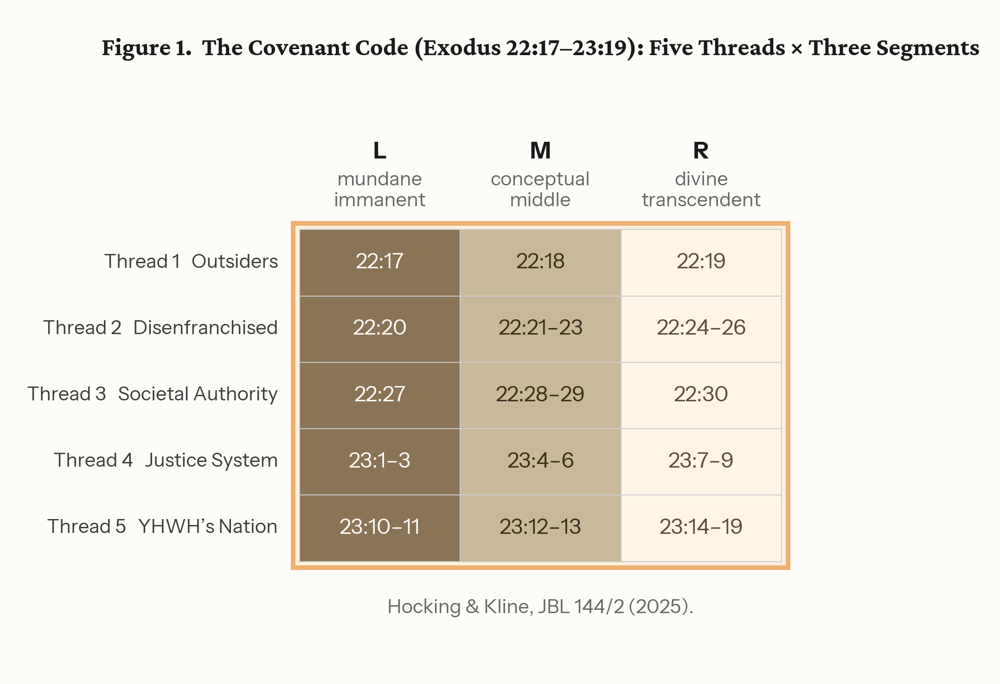{width=100%}

What follows in Sections 3–7 is a book-by-book summary of the published structures. Readers familiar with the prior publications may move directly to Part II; the summaries are included so that the paper is self-contained, and so that the dimensions that matter for the grid — the row and column counts of each book — are established from the published record before they are combined.

### 3. Leviticus: "Structure is Theology"

We begin with Leviticus, because Leviticus is the architectural center of the composition — the point where, as Part II will show, the horizontal and vertical threads of the Torah intersect.

Leviticus contains 22 literary units — not the 27 chapters of the printed Bible. The units are organized as eight structural elements: seven unit-triads (groups of three connected units sharing a column) and a single unit standing alone, Unit 13 (Leviticus 19), which carries the declaration "You shall be holy, for I, YHWH your Elohim, am holy" (19:2). Within each unit, the same vertical grammar operates that will recur throughout this paper. In the opening unit (Leviticus 1–3), the burnt offering — entirely for the deity — occupies the top row; the well-being offering — primarily for the devotee — occupies the bottom; and the meal offering — primarily for the priest — sits between them. The arrangement is a visual presentation: the heavenly above, the earthly below, and the priest in the middle, mediating. This three-tier paradigm, established in the book's first unit, is employed extensively across Leviticus; every unit-triad contains one unit oriented toward the deity, one oriented toward the people, and one operating between them. The reader should hold onto this published observation, because it is the seed of the register semantics to which Part III returns.

The arrangement of the eight elements is an introversion. Six of the seven unit-triads pair across the center to form three concentric rings around Unit 13: an outer ring, a middle ring, and an inner ring. Each ring is marked by its own identifier, present in five of its six units: the outer ring by the place where YHWH speaks to Moses (the tent of meeting, Mount Sinai), the middle ring by the formula of seven days followed by the eighth day, the inner ring by a density of familial terms — place, time, and person. And each ring is tied to a precinct of the Tabernacle through its opening unit: the outer ring opens at the altar in the court (the freewill offerings of Leviticus 1–3), the middle ring opens with Aaron and Moses entering the sanctum (Leviticus 8–10), the inner ring opens with the high priest's entrance into the inner sanctum on the Day of Atonement (Leviticus 16). Court, Holy Place, Holy of Holies — the book's structure is the Tabernacle's structure, read concentrically.

At the center of the rings, Unit 13 corresponds to the ark of the covenant. It contains sixteen first-person revelations — "I am YHWH" — matching the deity's self-revelation from between the cherubim above the ark, and it contains the fragments of the Decalogue that commentators have long noticed in Leviticus 19, embedded in a two-column structure that can be read as two tablets. The reading that follows from the structure is experiential: the book leads its reader along the path of the high priest on the Day of Atonement, inward through court and sanctum to the place of the imitatio Dei — "You shall be holy" is addressed not to the priests but to the whole community — and then back out. Before Unit 13, the laws are oriented to individuals; after it, to the community. The way in and the way back out are built into the shape of the book. This analysis was published as "Structure is Theology: The Composition of Leviticus" (in Roy Gane and Ada Taggar-Cohen, eds., Current Issues in Priestly and Related Literature: The Legacy of Jacob Milgrom and Beyond, SBL Press, 2015, pp. 225–264) — the last research project Jacob Milgrom closely supervised, presenting a concentric alternative to Mary Douglas's division of the book into three consecutive parts. Douglas worked on Leviticus and Numbers with a different structural model; the method here responds to her evidentiary standard while producing a different result. The analysis has since been independently examined in Hocking's Chester dissertation, and the full four-part presentation of the structure is published in the Leviticus analysis series at chaver.com.

One element of the published structure must be flagged now, because Part II depends on it. Six unit-triads form the rings; the seventh does not. Unit-triad C — the impurities triad (Leviticus 13–15: scale disease, its purification, genital discharges) — stands entirely outside the introversion. The symmetry of the rings appears only when it is removed. The 2015 essay reads this asymmetry as deliberate: the three units deal exclusively with impurities, and their presence makes the structure itself impure; the reader, like the priest, must remove the impure from the camp in order to maintain its purity — the impurities triad is the screen that must be moved aside before the inner sanctum. Note what this means for everything that follows: the removal of the impurities column is not a device of the present paper. It has been in print since 2015, a decade before anyone counted the columns of the horizontal thread. Counting them is Part II's task: seven triads plus the central unit yield eight column positions; with the impurities column removed, seven.

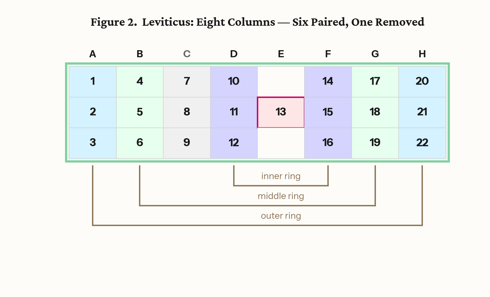{width=100%}

### 4. Genesis

Genesis contains 19 literary units arranged as a matrix of three rows and seven column positions. Six columns are triads — one primordial and five patriarchal — and a seventh is held by a single independent unit, the tower of Babel (Unit 4), which stands outside the triadic pattern just as the impurities triad stands outside the introversion in Leviticus and the central unit stands alone in each book. The primordial triad (Units 1–3) comprises three linked creation narratives, each opening with a verse containing the root ברא ("create"). The five patriarchal triads (Units 5–19) are organized in three blocks: the Abraham narrative and the Isaac–Jacob narrative (two triads each), and the Joseph narrative (one). The blocks announce their own boundaries: clustered "generations of" (toledot) headings mark each generational transition, and each block closes with death formulas. Within the two large blocks, the triads alternate between two threads of material — one carrying covenants and altars, the other family. The six triadic columns pair concentrically across the book's center: the primordial triad (creation) with the Joseph triad (ordering of the world), the two covenant triads with each other, and the two family triads with each other — three concentric pairs, each marked by shared vocabulary and mirrored themes (*Before Chapter and Verse*, Genesis Part D).

The three rows of Genesis carry the divine names. In the patriarchal units (5–19), the distribution is consistent across the rows: in Row 1 (Units 5, 6, 11, 12, 17) only YHWH appears — the name associated with beginnings, generations, and expansive blessing; in Row 3 (Units 9, 10, 15, 16, 19) Elohim appears almost exclusively — the name associated with limitation, fear, testing, and death; and in Row 2 (Units 7, 8, 13, 14, 18) both names operate, forming the interface between the transcendent and the immanent. The criterion is dramatic, not lexical: what is counted is the deity onstage — the narrator presenting YHWH or Elohim acting or speaking within the unit — not occurrences of the names in the mouths of characters (Before Chapter and Verse, "A Note About Names"). The primordial units prepare this grammar in a four-step progression: Unit 1 stages Elohim alone; Unit 2 the joined name YHWH Elohim; Unit 3 both names separately; Unit 4 YHWH alone. The joined name of the Garden divides, and the divided names are then distributed to the rows. It is worth stating carefully what is specific to Genesis here: the assignment of divine names to rows is a feature of Genesis only. Beyond Genesis, as we will see, the three-row system continues to operate, but the rows carry orientation — which direction is heaven-ward — rather than divine names. Genesis establishes the vertical grammar; the later books deploy it.

Babel's row placement repeats across the books: Genesis sets it in Row 2 of its column — the interface row — exactly where Leviticus sets Unit 13. The reader will notice what this does to the central datum of source criticism. The alternation of divine names — the observation from which the Documentary Hypothesis grew — is, in the two-dimensional reading, not an alternation at all. It is a row assignment. The names do not vary because two documents were interleaved; they vary because the composition assigns each name a register, and the registers alternate as the linear reading descends through the matrix.

The outline of the Genesis structure appears in the 2015 SBL essay; the full presentation is in Before Chapter and Verse: Reading the Woven Torah (2022), and the complete unit texts, with their structural markers, are published at chaver.com and in the Torah Literary Units Dataset (Zenodo, DOI 10.5281/zenodo.19625073).

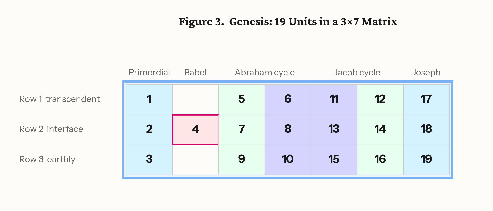{width=100%}

### 5. Deuteronomy

Deuteronomy contains 13 literary units: four triads plus one independent unit (Unit 13), yielding five column positions across the same three triadic rows — a 3 × 5 matrix. The four triadic columns carry a progression through the covenant relationship: historical narrative (Israel's past), covenant principles, the legal corpus, and the covenant future — warnings and promises in prophetic perspective. The first and last triadic columns pair across the center: each unit in Column A (past victory) meets its exact reversal in Column D (future defeat) — the victories that demonstrated the deity's power to deliver become, reversed, the measure of judgment for covenant unfaithfulness. The inner pair, Columns B and C, likewise pair: covenant principles with the legal corpus that implements them (Deuteronomy analysis, chaver.com). Four triadic columns, two concentric pairs. Unit 13, the blessings and Moses' farewell, stands outside the triadic pattern as the culminating unit of the book and of the Torah. Its placement in Row 2 — the mediating row — repeats the pattern observed in Genesis and Leviticus: all three books of the horizontal thread place their independent unit in the interface position, the row where the other two orientations meet.

One further feature of Deuteronomy is registered here because Part II depends on it: its triads run in the opposite vertical direction from those of Genesis. In Genesis, the first unit of each triad is oriented above and the third below; in Deuteronomy, the first is oriented below and the third above. The two outer books of the horizontal thread are mirror-oriented bookends — Genesis moving from above to below, Deuteronomy from below to above. The hinge between the two orientations is itself part of the published record: the first half of Leviticus is oriented like Genesis, the second half like Deuteronomy, and the reversal occurs at Unit 13 (Before Chapter and Verse, Fig. 49; chaver.com, Leviticus Part D and "Beyond JEDP"). What Part II adds is not the hinge but what the hinge does when the three books are laid on a single compositional field.

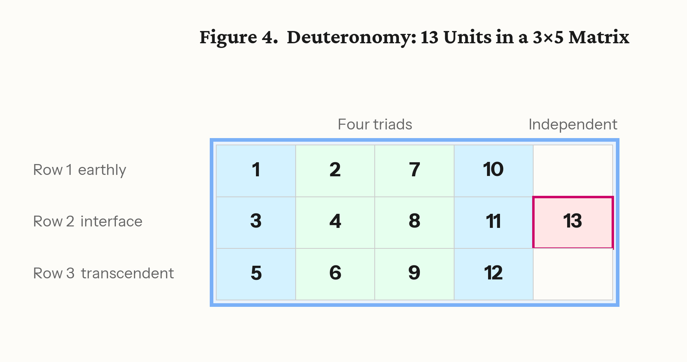{width=100%}

### 6. Exodus: Two Arrangements

Exodus contains 19 literary units, and unlike Genesis, Leviticus, and Deuteronomy, it is not built from triads. Its 19 units comprise four quads — groups of four — plus three independent units (Units 5, 10, and 15). The quads carry the book's four bodies of material: the Egypt narrative (Units 1–4), the wilderness and Sinai narrative (Units 6–9), the Tabernacle instructions (Units 11–14), and the Tabernacle construction (Units 16–19). The three independents mark the transitions between them: Unit 5, the sea crossing, carries Israel from Egypt to the wilderness; Unit 10, the covenant confirmation, carries the book from narrative to Tabernacle; Unit 15, the golden calf and the renewed tablets, carries it from instruction to implementation.

The published arrangement sets the four quads as 2 × 2 blocks around the three independents: a five-row layout that mirrors the five-row camp arrangement of Numbers (Section 7). In the published reading, Exodus presents the heavenly pattern — its central unit recalls Ezekiel's vision of the divine throne above the firmament — and Numbers presents the earthly counterpart: the heavenly chariot above, the earthly vehicle below. The quads pair across the central axis: the brick-making for Pharaoh in the Egypt quad answers the building for YHWH in the construction quad. That arrangement stands; nothing in this paper revises it.

But the same nineteen units carry features the quad layout cannot accommodate. Two features in particular: Unit 4 ends with the Israelites taking the treasure of Egypt, and Unit 11 — separated from Unit 4 by six intervening units in the linear text — begins with that same treasure given for the building of the Tabernacle. This single material arc, whose two halves are presented in succession only when Units 4 and 11 are placed in the same column, is invisible in both the linear reading and the quad arrangement. Similarly, Unit 9 ends with the Sabbath, and Unit 16 begins with the Sabbath — a temporal bracket whose two ends meet only when Units 9 and 16 share a column. These continuities are not features the quad layout suppresses; they are features for which the quad layout has no room. The published material arc and the published Sabbath bracket each presuppose a stacking that the quad arrangement does not provide.

The stacking they presuppose is the second arrangement this paper explores. Each half of Exodus forms two parallel columns of four units, with the three independents (Units 5, 10, 15) running down the center column between the halves — five columns, nine rows. Units 1–4 and 6–9 occupy rows 1–4; the three independents occupy row 5 (Unit 5 at the left, Unit 10 at the center, Unit 15 at the right); Units 11–14 and 16–19 occupy rows 6–9. The five-column footprint matches Numbers exactly — Exodus and Numbers are twin flanking books, each five columns wide on the vertical thread. The dual-axis reading is not a device of the analyst; it is a property of two-dimensional composition itself. An element placed on a grid occupies a position defined by both its row and its column. It necessarily participates in the relationships that run along each axis — just as a cell in a weave is simultaneously part of its warp thread and its weft thread. The quad arrangement reads the row relationships of Exodus — how the nineteen units relate to each other across the horizontal axis. The vertical arrangement reads the column relationships — the form in which Exodus stacks with Leviticus and Numbers on the inter-book grid. The two are not alternatives the scribe chose between; they are orthogonal projections of the same grid, each revealing connections that run along its axis. The quad layout displays the cross-axis pairings (brick-making to building, Egypt quad to construction quad); the vertical arrangement displays the column continuities (treasure to Tabernacle, Sabbath to Sabbath). Both are present in the text; both are compositionally active. Part II will use the vertical arrangement because it is the form in which Exodus contributes nine rows to the vertical thread.

One more feature of the arrangement deserves note here. At the center of Exodus — Unit 10, the middle of the central band of independents — the elders ascend the mountain and see beneath the feet of the deity "the likeness of a pavement of sapphire, like the very heavens for purity" (Exodus 24:10). The vision of the heavenly floor sits at the structural center of the book; the published reading already marks this unit as the pivot at which the book passes from narrative to Tabernacle: the nine units before it carry no Tabernacle material; the nine units after it are entirely Tabernacle. When Part II places Exodus at the top of the vertical thread, the position of this vision — the cosmic ceiling seen at the center of the upper zone — will take on compositional weight.

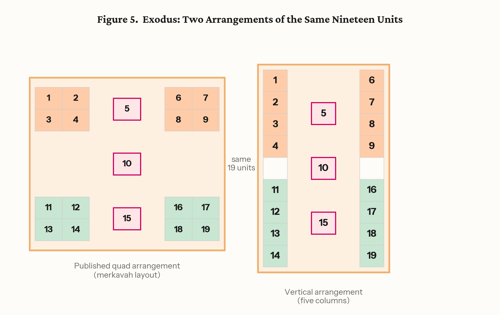{width=100%}

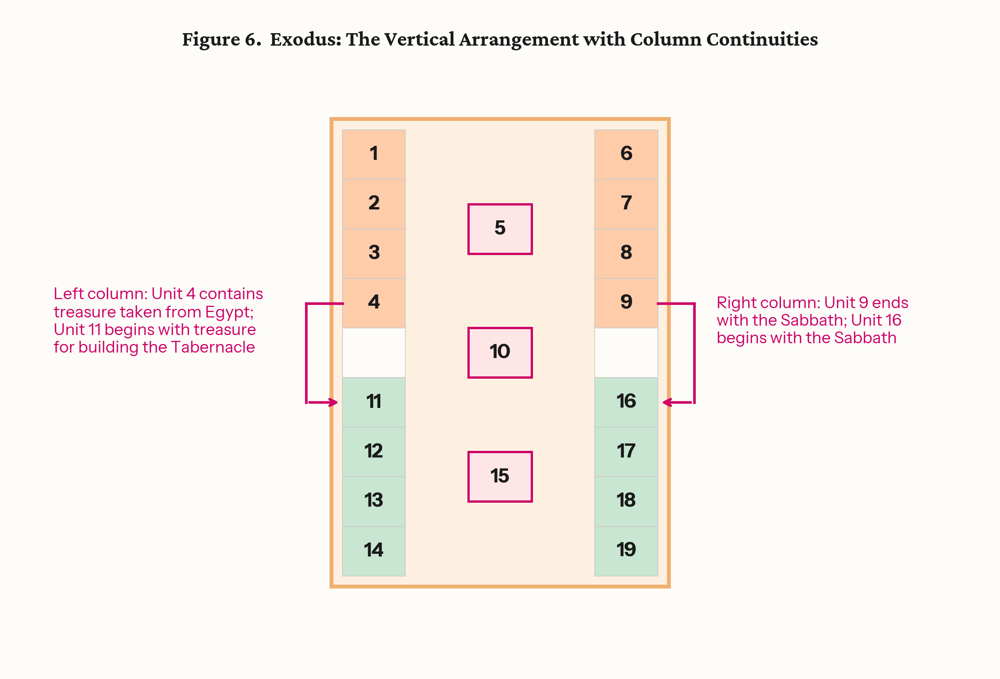{width=100%}

### 7. Numbers

Numbers contains 13 literary units, and the book itself announces its arrangement: the Israelite camp. Numbers 2 positions the twelve tribes in four groups of three around the Tabernacle, each side led by a flag tribe — Judah east, Reuben south, Ephraim west, Dan north. The book's units take the same form: four sides of three units each around a single central unit, a 5 × 5 block. The four units at the midpoints of the sides — Units 2, 6, 8, and 12 — are the flags, and they are marked objectively: each consists entirely of law without narrative, and no other unit in the book does. The text flags its own four sides.

At the center stands Unit 7: the Sabbath violator, the command of the tassels, and the Korach rebellion — the dispute over who may approach sacred space, answered when the earth opens to swallow the rebels and sealed when Aaron's staff buds before the ark. The published reading describes the camp as the deity's garment — Israel the cloak that makes the invisible presence visible in the world ("The Book of Numbers Is a Map of the Camp," chaver.com, based on Before Chapter and Verse) — and the requirement attached to the tassels is the same one that stands at the center of Leviticus: "you shall be holy."

Note the relation between the centers of the three vertical-thread books, because Part II will build on it. At the center of Exodus, the divine presence is above: the elders look up from below the sapphire pavement at Sinai. At the center of Leviticus, the presence is in the midst: "I, YHWH your Elohim, am holy," spoken from the position of the ark. At the center of Numbers, the presence reaches the ground itself: the earth opens. The published reading describes this as the progressive descent of the divine presence — mountain, Tabernacle, camp. Three books, three centers, three levels: above, between, below.

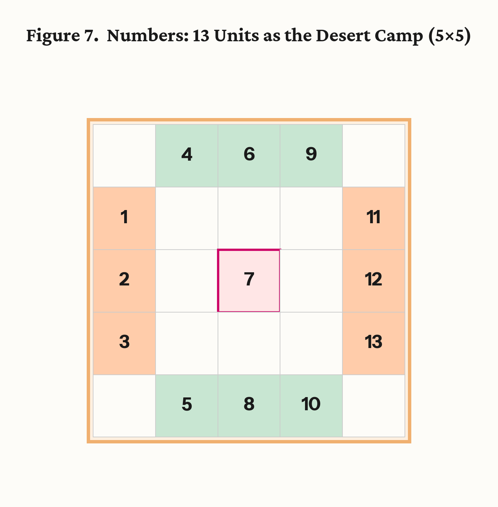{width=50%}

---

*End of Part I.*

---

## PART II — THE 19 × 19 GRID

### 8. The Horizontal Thread

Part I presented each book's structure as it was published. We now place three of those structures side by side — the step that produces the observation this paper reports.

Genesis, Leviticus, and Deuteronomy share a common feature that Exodus and Numbers do not: each is built from triads arranged in three rows. When these three triadic books are laid end to end, their columns form a continuous horizontal band. The column count is straightforward. Genesis contributes seven column positions (Section 4). Leviticus, with its seven triads and central unit, contributes eight (Section 3). Deuteronomy contributes five (Section 5). The total is twenty columns: seventeen triadic and three independent.

The seventeen triadic columns are not a miscellaneous collection. They are paired. Genesis pairs three triadic columns with three (six columns); Leviticus pairs three with three (six more); Deuteronomy pairs two with two (four). That accounts for sixteen of the seventeen triadic columns. The one left over — the impurities triad — connects to nothing. It is the sole triadic column in any of the three books without a partner, the one column that stands outside every pairing structure. Its content is what the priest must remove; its structural position is what the symmetry requires removed. With that column set aside, the count becomes nineteen: Genesis seven, Leviticus seven, Deuteronomy five.

What makes the column's role double is the coincidence of content and form: the column whose subject matter is "that which the priest must remove" is also the column whose removal produces the canonical dimension. The removal has been in print since 2015. The dimension it yields is the new observation.

Through the first half of the horizontal band — Genesis and the first half of Leviticus — the triadic orientation places heaven above: Row 1 carries the transcendent register, Row 3 the earthly. At Leviticus Unit 13, the center of the band, the orientation reverses. Through the second half of Leviticus and into Deuteronomy, the order inverts: Row 1 carries the earthly, Row 3 the transcendent (Section 5; *Before Chapter and Verse*, Fig. 49). What Part I registered as a published feature of the individual books — the mirror between Genesis and Deuteronomy, the hinge at the center of Leviticus — now takes on a compositional function: it structures the nineteen-column band as a single field with a pivot at its center, and the pivot is the same unit that stands at the center of the Tabernacle architecture described in Section 3. Leviticus is oriented like Genesis up to Unit 13, then like Deuteronomy from Unit 13 onward.

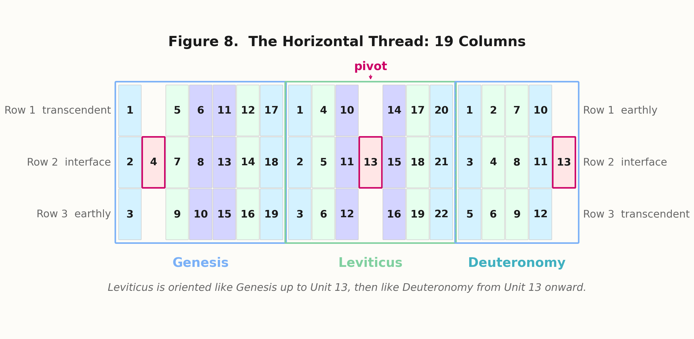{width=100%}

### 9. The Vertical Thread

Turn now to the second thread. Exodus, Leviticus, and Numbers share a different common feature: all three are set primarily at Horeb. They are not three sequential subjects — Egypt, then law, then wilderness — but three aspects of a single sustained encounter at the sacred mountain. What the cosmos looks like above, at the center, and below during the Horeb revelation is distributed across three books.

Using the vertical arrangement of Exodus established in Section 6, the row count proceeds as follows. Exodus contributes nine rows. A register divider separates it from Leviticus. Leviticus contributes three rows. A second register divider separates it from Numbers. Numbers contributes five rows. The total: nine, one, three, one, five — nineteen rows.

A question arises: why do the register dividers count as rows on the vertical thread, when the boundaries between Genesis, Leviticus, and Deuteronomy on the horizontal thread occupy no compositional space? The asymmetry is not arbitrary; it reflects a difference in the kind of boundary crossed. The horizontal thread's three books share the same structural grammar — all triadic, all three rows deep, the same row system running continuously across them. The transition from Genesis to Leviticus to Deuteronomy is a transition within a single register band: the same kind of content at the same compositional level, columns extending a continuous field. Transitions within a register occupy no compositional space because nothing changes in the orientation of the surface.

The vertical thread is different in kind. Its three books occupy qualitatively different zones of the cosmos — celestial (Exodus), mediating (Leviticus), terrestrial (Numbers). The transition from Exodus to Leviticus is not a continuation at the same level; it is a crossing between cosmic domains — from the heavenly vision to the priestly mediation — the kind of boundary that Egyptian scribes marked with scored lines on the working surface. Part III will show that these domains correspond to distinct architectural surfaces in the royal tomb; here the point is narrower: in the compositional convention this paper identifies, boundaries between registers are physical features of the field. On Egyptian stelae and tomb walls, the scribe scores the groundline onto the working surface — papyrus, plaster, or stone — before placing content in either register. The groundline is a distinct horizontal band that occupies compositional space, as much a marked element of the surface as the figures it separates. Within a register, scenes succeed one another by adjacency, with no physical line between them; between registers, the boundary is drawn. (Robins, *The Art of Ancient Egypt*, rev. ed., 2008, on register conventions; Schäfer, *Principles of Egyptian Art*, ed. Brunner-Traut, trans. Baines, 1974, on the groundline as a structural feature.) Every multi-register Egyptian composition includes groundlines; a field without them would be the anomaly. The convention requires them, and counting them is simply counting what the convention places on the compositional surface. The divider rows carry no textual content — and this is precisely what the convention predicts: groundlines are marked bands of the surface, not carriers of content.

The three books occupy three vertical zones, and the centers of the three books — already noted in Section 7 — mark those zones. At the center of Exodus (Unit 10), the elders ascend and see the sapphire pavement of heaven: the cosmic ceiling. At the center of Leviticus (Unit 13), YHWH speaks from the position of the ark: the divine presence in the midst, neither above nor below. At the center of Numbers (Unit 7), the earth opens to swallow Korach: the terrestrial surface acts. Upper zone, middle zone, lower zone — and the register dividers that separate them correspond to the transitions between books within the Horeb experience, as visible on the compositional field as the horizontal lines that separate registers in any multi-register composition.

The word "register" is deliberate. Three semantically assigned vertical levels, separated by dividers, with each level carrying its own orientation — this is a standard structure in ancient compositional practice, and it has a name. Part III will identify the paradigm and show where it comes from.

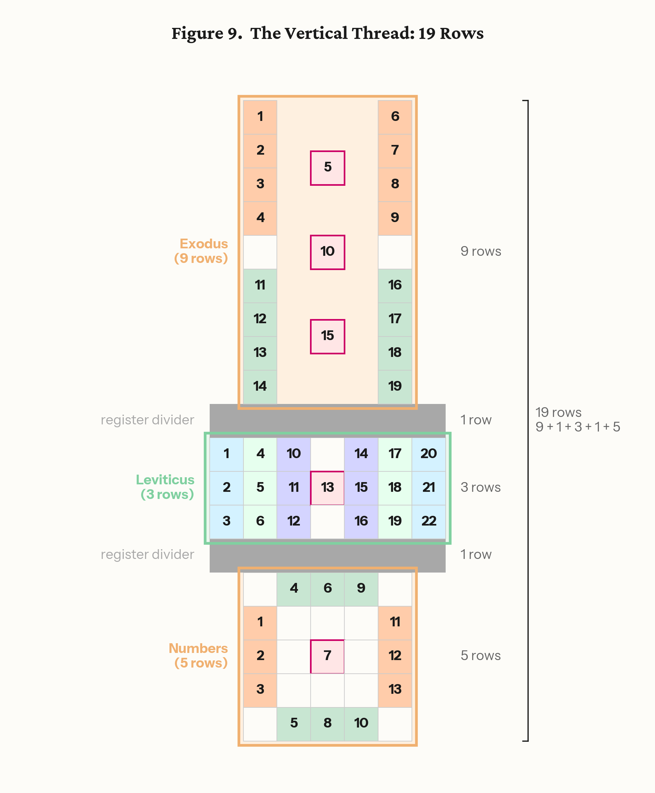{width=100%}

### 10. The Complete 19 × 19 Grid

When the horizontal and vertical threads are placed on a single compositional field, the result is a square: nineteen columns across, nineteen rows down, with Leviticus at the intersection, the only book that belongs to both threads.

The grid was not imposed on the structures. Each book's arrangement was established independently through internal structural analysis, published and verified before anyone counted the aggregate dimensions. The 19 × 19 matrix is what those published structures produce when they are set side by side and stacked — a consequence of the structures, not a premise of the analysis.

The variable widths of the vertical-thread books — Exodus five columns, Leviticus seven, Numbers five — are positioned on the nineteen-column field by the alignment of their central units: Unit 10 (Exodus), Unit 13 (Leviticus), and Unit 7 (Numbers) share the same column position, the spine of the vertical thread. Exodus and Numbers flank Leviticus at matching widths; Leviticus extends wider, filling the full horizontal band. Together with the independent units at the extremes of the horizontal thread — Babel near one edge, Deuteronomy Unit 13 at the other — these form the organizational spine of the grid (Figure 10).

The eighty-six units do not fill the field. The horizontal thread occupies the middle three rows; the vertical thread descends through the central columns; the remainder of the field is empty. This is the paradigm's own economy: the canonical grid defines the proportional field, and the figure drawn on it occupies only the region its form requires. The Torah's figure on the field is cruciform.

Several symmetries within the grid deserve attention. On the horizontal thread, the three books contribute 19, 22, and 13 units respectively (Genesis, Leviticus, Deuteronomy). On the vertical thread, the same sequence: 19, 22, and 13 (Exodus, Leviticus, Numbers). The entry book on each thread carries 19 units; the exit book carries 13. The flanking pair on each thread sums to 32 — Genesis plus Deuteronomy, Exodus plus Numbers — and Leviticus, with 22 units, sits at the intersection of both. Eighty-six units across five books, arranged on a 19 × 19 field, balanced around a center that serves both threads at once.

What is a 19 × 19 square in compositional terms? Is there a known paradigm in which nineteen is the canonical unit of a grid — and in which cosmic narratives are composed on three registers separated by dividers, with a central pivot where orientation reverses? There is. Part III identifies it.

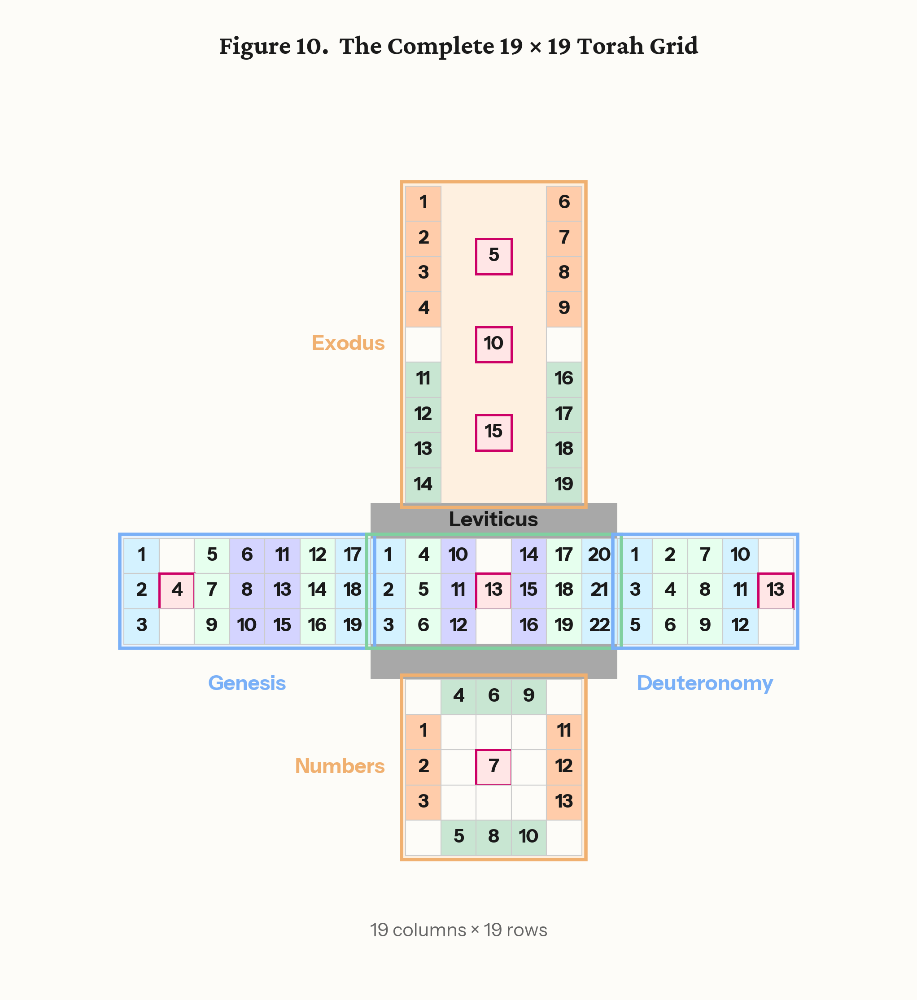{width=100%}

---

*End of Part II.*

---

## PART III — THE EGYPTIAN PARADIGM

### 11. The Canon of Proportions

The 19 × 19 square is not an arbitrary number. In Egyptian compositional practice, the 18-unit grid — eighteen squares from the soles of the feet to the hairline, nineteen to the crown of the head — was the fundamental module on which every human figure was drawn, carved, or painted. The grid was the first thing marked on any compositional surface: a network of horizontal and vertical lines defining the proportional field, with each body landmark falling at a predetermined intersection. The system was codified no later than the Old Kingdom and remained in use through the end of the New Kingdom (c. 3100–1077 BCE) — more than two thousand years of continuous scribal training on the same proportional module (Iversen, *Canon and Proportions in Egyptian Art*, 2nd ed., 1975; Robins, *Proportion and Style in Ancient Egyptian Art*, 1994; the two accounts differ on points of historical development, but the core description of the eighteen-to-nineteen module and its pre-New Kingdom origin is shared).

The canonical number is eighteen to the hairline — the boundary of the proportioned figure — and nineteen to the crown, the boundary of the compositional field. The distinction matters: eighteen defines the proportioned body; nineteen defines the space within which the body is composed. It is the compositional field, not the proportioned body, that the Torah's grid matches — and the compositional field is the working surface the scribe lays down before any content is placed. The claim is not that Egyptian walls were nineteen squares wide; compositional grids scaled to the surface. The claim is that nineteen is the canonical module — the unit of proportional measure — and the Torah is composed on that module in both dimensions.

The grid changed exactly once. In the 25th/26th Dynasty (c. 664 BCE), the canon was reformed from eighteen to twenty-one squares. The Torah's grid uses the traditional module, not the reformed one. The distinction between decorative archaism and operational use matters here. Archaism in late Egyptian art is well attested — antiquarian copying of older styles is a known phenomenon of the Saite period — but archaism produces stylistic imitation of finished surfaces. It does not produce the operational deployment of a compositional module as the live structural armature of a literary work of five books and eighty-six units. A post-reform scribe could imitate the look of older figures; building a composition of this scale on the older module would require active scribal fluency in that module's compositional grammar. The Torah's use of the eighteen-to-nineteen module is structural and load-bearing, not decorative. This observation bears on the dating question discussed further in Section 13.

An Egyptian-trained scribe, encountering a composition built on a nineteen-unit square, would recognize the module immediately. It was not a number among others; it was the number — the first thing learned, the grid on which every compositional surface began.

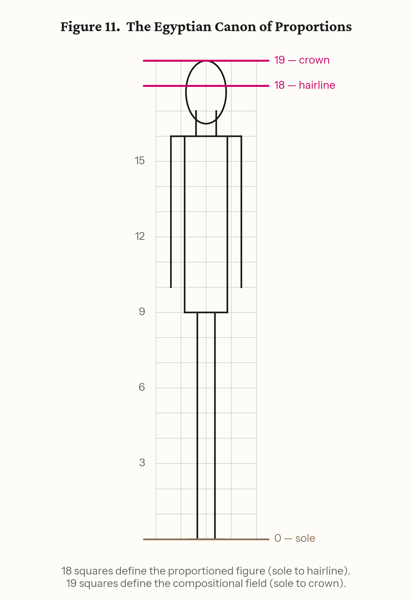{width=100%}

### 12. The Amduat: How Egypt Composed Cosmic Narratives

The canonical grid defines the module. What defines the paradigm — the way a cosmic narrative was composed on that grid?

The answer is attested most fully in the Amduat ("That Which Is in the Underworld"), the oldest and most complete of the Egyptian books of the afterlife. First attested in royal tombs of the early Eighteenth Dynasty (c. 1470 BCE), the Amduat describes Ra's nocturnal journey through twelve hours of the night — from the western horizon through the underworld to rebirth at dawn. The composition exists in two formats: a narrative version (continuous text with illustrations) and a tabular version (the twelve hours arranged as a grid). Both formats present the same content. The grid is not an abstract of the narrative; the narrative is a linearization of the grid.

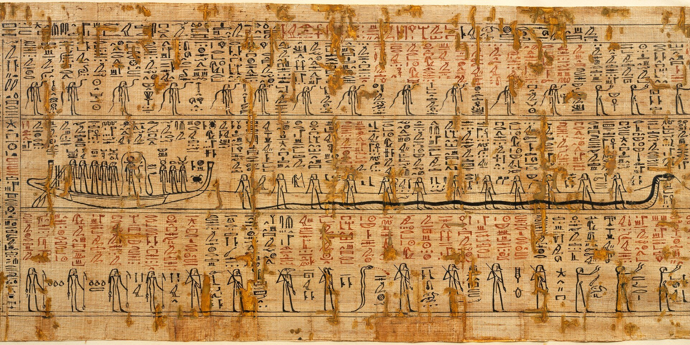{width=100%}

The compositional structure has four features that define the paradigm.

First, sequential units forming a grid. The twelve hours proceed in order, each a self-contained scene with its own cast, landscape, and action, but each also occupying a fixed position in a larger compositional field.

Second, three semantically assigned registers. Each hour is divided vertically into three bands separated by register dividers — horizontal lines, often rendered as the waters of the Duat. The upper register carries the celestial backdrop: stars, protective deities, the sky above the journey. The middle register carries the divine barque: Ra moving through the underworld, the protagonist of the narrative. The lower register carries the chthonic forces: enemies, the dead, the earth's own action. The three registers are not three stories but three simultaneous aspects of a single hour — what the cosmos looks like above, at center, and below at each point in the journey.

Third, a central pivot. At Hour 6, the midpoint, Ra descends to the deepest chamber of the underworld and unites with Osiris — the solar deity meeting the chthonic deity, the living joining the dead. This union produces the regeneration that enables Ra's ascent through the second half of the journey. The pivot is the structural and narrative center of the composition.

Fourth, the composition maps onto sacred architecture. The Amduat was inscribed on the walls of royal tombs; the physical space of the burial chamber embodied the compositional space of the text. The tomb was the grid made habitable.

This was not one scribe's invention. It was how Egyptian scribes composed cosmic narratives — the standard paradigm, attested and copied for centuries, for representing a divine journey through a structured cosmos. A scribe trained in this tradition, composing a text about the relationship between the divine and the human — a journey from creation through revelation to settlement — would have this paradigm at hand.

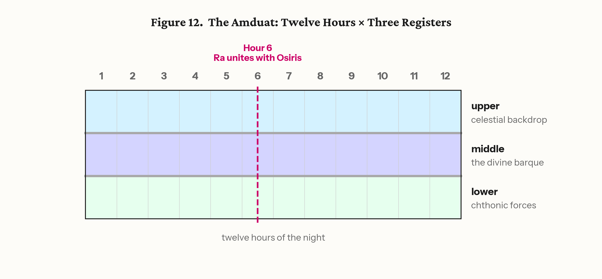{width=100%}

### 13. The Torah Follows the Paradigm

The structural correspondences between the Amduat paradigm and the Torah's grid run along both threads and at two scales. The paradigm operates at two scales, and the two must be distinguished: within the journey, the three rows of each triadic column correspond to the Amduat's three registers within each hour; around the journey, the three books of the vertical thread correspond to the three surfaces of the royal burial chamber. What follows traces both.

The horizontal thread (Genesis–Leviticus–Deuteronomy) follows the journey pattern. Sequential units move through a timeline. In Hebrew, the right-to-left reading direction means Genesis — the beginning — is encountered first, at the right edge, and Deuteronomy — the ending — last, at the left. The conventional Hebrew association of the right hand (yamin) with primacy and beginning reinforces the placement: Genesis at the starting point, Deuteronomy at the end. (The figures in this paper use the standard left-to-right print orientation, with the directional sense supplied here.) The orientation reverses at the midpoint: the cosmic order that placed heaven above through the first half of the band places it below through the second (Section 8). At the center, Unit 13 carries the declaration in which the two divine names held apart across the rows of Genesis — YHWH above, Elohim below — appear together: "You shall be holy, for I, YHWH your Elohim, am holy." This is not their union; it is the revelation of the means by which the separated aspects are to be reconciled — Israel becoming holy, representing YHWH in the reality of Elohim's world. Compositionally, this center occupies the same structural position as Ra's union with Osiris at Hour 6. The paradigm is the same; the content transforms it. In the Amduat, the union is cosmic and automatic — Ra and Osiris meet because the cycle requires it. In the Torah, the reunion is commanded and depends on human action.

The horizontal thread carries the three-register pattern as well. Each column of the horizontal thread — each unit-triad — has three rows, and the rows carry the same semantic assignments as the Amduat's three registers within each hour: Row 1 is the transcendent register (in Genesis, the YHWH row), Row 2 the interface (where both names operate), Row 3 the earthly register (in Genesis, the Elohim row). Three rows per column, three registers per hour — the horizontal thread's internal anatomy matches the Amduat's.

The paradigm extends from the pictorial to the architectural — from the three registers within the journey to the three surfaces around it. In the royal tombs where the Amduat was inscribed, the journey did not occupy the chamber alone. In the tomb of Seti I (KV17, c. 1279 BCE), the vaulted ceiling carries astronomical scenes — constellations and decans in indigo and gold, the firmament itself — while the corridor and chamber walls carry the Amduat and Book of Gates: the journey beneath the sky (Hornung, *The Ancient Egyptian Books of the Afterlife*, 1999). In the tomb of Ramesses VI (KV9, c. 1136 BCE), the three-surface program is fully explicit: the ceiling bears a double image of the sky goddess Nut framing the Books of Day and Night; the burial chamber walls carry the Book of the Earth — fully developed here for the first time in a royal tomb, depicting the subterranean regions of the dead (Roberson, *The Ancient Egyptian Books of the Earth*, 2012); and the corridors carry the Amduat. Sky on the ceiling, earth at the deepest point, the journey between them — the tomb is a three-level cosmos rendered as habitable architecture.

The Torah's vertical thread follows the same spatial logic. The horizontal journey (Genesis–Leviticus–Deuteronomy) sits on the compositional surface — the walls. Above it sits Exodus, carrying the celestial register: "I spoke to you from heaven" (Exodus 20:19 [MT; English 20:22]), the Tabernacle as a copy of the heavenly pattern shown on the mountain (Exodus 25:40). Below it sits Numbers, carrying the terrestrial register: the camp on the ground, the serpents from the earth (Numbers 21:6), the division of land. The centers of the three vertical-thread books confirm the assignment:

| Surface | Tomb | Torah | Center |
|---------|------|-------|--------|
| Ceiling | Astronomical scenes (Nut, stars) | Exodus (above the journey) | Sapphire pavement of heaven (Unit 10) |
| Walls | Amduat (the journey) | Gen–Lev–Deut (horizontal thread) | "I YHWH your Elohim am holy" (Unit 13) |
| Floor | Book of the Earth | Numbers (below the journey) | Earth opens for Korach (Unit 7) |

The three books of the vertical thread are set at Horeb — not three journeys but three levels of a single encounter, just as the tomb's three surfaces are not three separate compositions but three aspects of a single architectural cosmos. The register dividers separating them correspond to the boundaries between the surfaces.

The three-surface program was a royal prerogative — only the king's burial chamber carried it. If the Torah's composition requires knowledge of the developed three-surface model, this narrows the institutional context of composition: the author had access to the royal scribal tradition. The fully developed three-surface program — with the Book of the Earth at the lowest level — is first attested in the late 19th Dynasty and appears in its complete form under Ramesses VI (c. 1136 BCE). Combined with the terminus ante quem provided by the grid reform of the 25th/26th Dynasty (c. 664 BCE), the three-surface correspondence points to a window: no earlier than the late 19th Dynasty, no later than the loss of active fluency in the traditional grid module. This is an observation, not a conclusion; the question of whether the window can be narrowed is taken up in Section 17.

And the impurities column — the sole unpaired triad whose removal yields the nineteen-column dimension (Section 8) — finds its place in the paradigm. The canonical grid is the idealized proportional field. The Torah includes one column whose content is specifically "that which must be removed," and its removal yields the canonical form. The grid contains its own instruction for achieving canonical status.

The whole composition sits on a 19 × 19 square — the Egyptian canonical module applied in both dimensions to a cosmic narrative composed on three registers within the journey and two architectural levels around it, with a central pivot where orientation reverses.

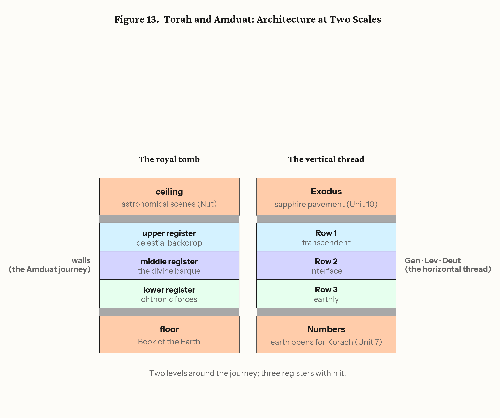{width=100%}

### 14. Process Evidence: The Signature Unit

The correspondences presented above show that the Torah's grid follows the Egyptian paradigm. But structural correspondence alone does not prove compositional method — a pattern can be observed after the fact without having been intended during composition. This section presents process evidence: features of the Torah's own construction that make sense only if the author held a complete two-dimensional original before converting it to linear text.

The evidence comes from a single unit: Deuteronomy Unit 8 (21:10–25:4), analyzed in full in *The Beautiful Captive Speaks: Revealing the Composition of the Torah* (Kline, 2025; academia.edu/143629453). The unit contains approximately fifty laws arranged across five pairs of rows and three columns designated L (Self), M (Self-and-Other), and R (Other). Each column opens with a variation on taking a wife (21:11, 22:13, 24:1). The monograph calls it the "Beautiful Weave." The same L-M-R column architecture operates in the Covenant Code (Exodus 22:17–23:19; JBL 2025) at a 15:30 segment ratio, with more than twenty laws held in common and systematically transformed — the same compositional instrument at two scales. What the Beautiful Weave does by columns, the Covenant Code does by rows. The paradigm is not a one-off; it is a compositional tool deployed repeatedly.

**(i) Serialization direction.** Of the Torah's eighty-six units, eighty-five were converted from their two-dimensional form to linear text by reading across the rows — the standard direction, which the Covenant Code also follows. Row-wise serialization reads Row 1 from left to right (or right to left), then Row 2, then Row 3; the result preserves the chronological or thematic flow of each row, and the text reads as a coherent narrative or legal sequence. The Beautiful Weave is the sole exception: it was serialized by reading down the columns — first Column L from top to bottom, then Column M, then Column R. Column-wise serialization tears thematic elements out of their row-wise positions and produces a text that, read linearly, jumps between apparently unrelated topics. This is exactly what a reader of Deuteronomy 21–25 encounters: the laws seem jumbled, moving without visible logic from captive wives to inheritance disputes to agricultural regulations to criminal penalties. The sequence is not jumbled; it follows column order rather than row order — and the agricultural and thematic cycles become orderly only when the laws are restored to the grid. Direction of serialization is invisible while uniform; one column-wise exception makes the act of serialization itself visible — and only an author holding a complete two-dimensional original can choose which axis to unroll. The choice presupposes the grid. The analogy is the unfinished Egyptian burial chamber, whose value lies precisely in preserving the working grid that the finished wall erases. יוצא מן הכלל להורות על הכלל — the exception that teaches about the rule.

**(ii) The double constraint.** The same six segments of Pair 5 satisfy two independent ordering systems at once. Read by column, the agricultural cycle is intact: planting (L), ripening (M), harvest (R) — a sequence scrambled across Deuteronomy 22–25 in the linear text and recoverable only in the two-dimensional reconstruction. Read by row, each column carries an abstract legal principle: Column L limits expansion (parapet, mixed seed, mixed yoke, mixed fabric, tassels at the edges); Column R limits contraction, ordered by ascending intentionality (forgotten sheaf, unbeaten boughs, ungleaned vines, counted lashes, unmuzzled ox); Column M synthesizes (eat but do not vessel; pluck but do not sickle). Two orthogonal ordering systems whose directions coincide on a single axis: position carries meaning before content does. Accretion can mimic one pattern; it cannot place two independent patterns on the same words.

**(iii) What the overlay legislates.** The abstract overlay — limiting expansion, limiting contraction — is the corpus's own published dyad between the divine characters, converted from narrative portrayal into legal principle. In the narrative, YHWH blesses expansively (land as far as the eye can see, seed as the dust of the earth); Elohim blesses within limits (Canaan only, one act of circumcision). In the Beautiful Weave, each column applies the opposite principle to its own force, and the harvest laws legislate the remainder: completeness is forbidden. This is the precise point of self-differentiation from the Egyptian paradigm. The agricultural cycle and the grid reflect the Egyptian scribal world, but in the Amduat the cosmic union recurs automatically — Ra and Osiris meet because the cycle requires it. Here the union is commanded, requires human restraint, and depends on a remainder. The author borrows the compositional technology and writes his own governing idea onto it.

**(iv) The center-signature link.** The beautiful captive who opens the unit — the woman taken from among the enemy, shorn, stripped of her captive garments, given a month to mourn before entering the household — is the Torah's one realized case of a designated-but-unfree woman. The law at the structural center of the entire composition, Leviticus 19:20–22 (cell 2B of Unit 13 — middle column, middle row, focal unit), legislates exactly this figure: the שפחה נחרפת, the designated bondmaid. A single legal figure connects the centermost cell of the weave to the one unit serialized by its warp. The connection is published in the monograph.

The unit is the composition's forgotten sheaf. Column R's law at the unintentional pole — the forgotten sheaf left standing in the field for the one who comes after — describes what the unit itself does. Egyptian tombs preserve the craftsman's working marks; what was not cleared away is how we know the work was made. The one unit not gathered into the uniform serialization is left standing in the field, and the finder is fed by what it preserves: the evidence of the maker's hand. In the law, the forgetting is unintentional by definition; in the composition, it is the most deliberate act in the Torah. The author legislated his own remainder. Form enacts content.

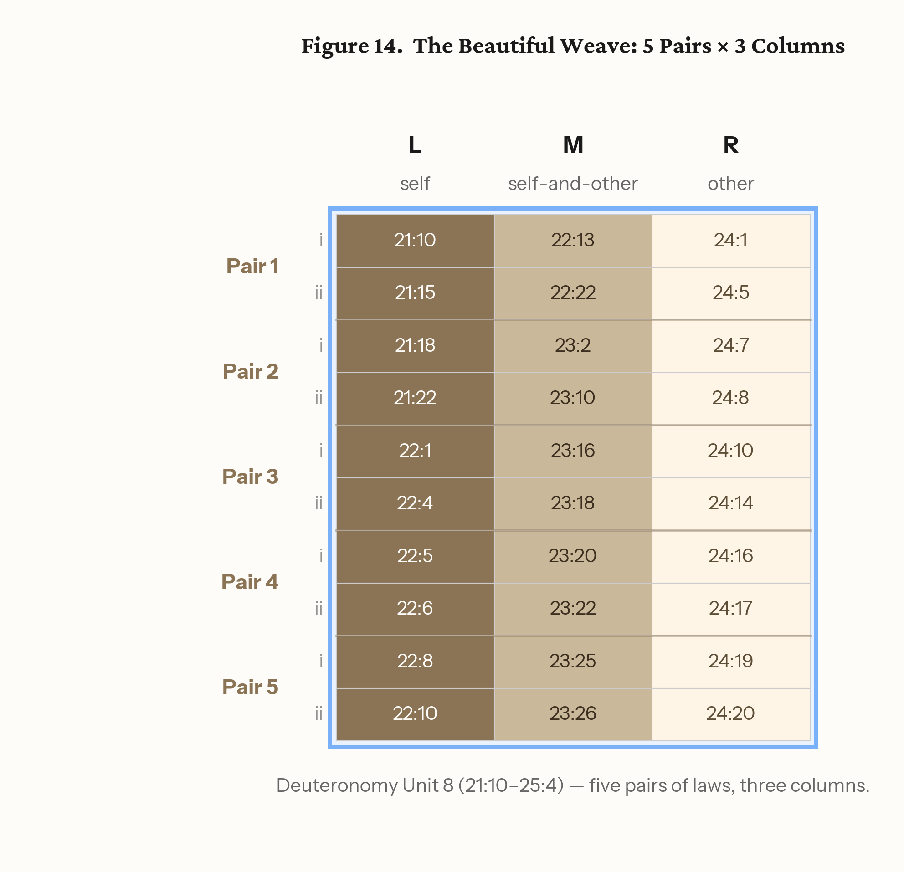{width=100%}

### 15. Egyptian Grid Texts: The Technology Existed

The preceding sections have identified the paradigm and presented process evidence that the Torah was composed within it. One question remains for Part III: did the compositional technology exist? Could an Egyptian scribe compose a text on a grid for multi-directional reading?

The answer is attested directly. In the tomb of Kheruef (TT192, Thebes, c. 1353 BCE), a 14 × 13 rectangular grid of hieroglyphic text appears above the offering scenes, composed to be read "across and down" — a text designed for multi-directional reading on a grid, from exactly the period relevant to the Torah's composition (The Epigraphic Survey, *The Tomb of Kheruef: Theban Tomb 192*, OIP 102, Chicago, 1980).

A more elaborate example survives on the Paser Crossword Stela (British Museum, BM 194, c. 1150 BCE): a grid of hieroglyphs composed to be read "three times" — horizontally, vertically, and — on one reading — around the perimeter. The stela's own inscription claims that "its like has not been seen before" — a boast that presupposes the technology was known while asserting the execution was unprecedented in complexity (Stewart, "A Crossword Hymn to Mut," *Journal of Egyptian Archaeology* 57, 1971, 87–104).

The compositional technology the Torah would require — a text composed on a grid, readable in two dimensions — is attested in Egyptian scribal practice of exactly the relevant period.

---

*End of Part III.*

---

## PART IV — IMPLICATIONS AND QUESTIONS

### 16. An Alternative to JEDP

The Documentary Hypothesis explained the Torah's complexity by positing multiple sources. The doublets, the alternating divine names, the interleaving of law and narrative — all were read as seams between documents, evidence that what we have was assembled from what once existed separately. The hypothesis was not unreasonable; it was the best available explanation for features that no known compositional model could account for. The point holds regardless of which form of the hypothesis one prefers — all begin from the same observed features of the text and differ in how the compilation is reconstructed. The argument here addresses the shared premise: that the features require compilation at all.

This paper has presented such a model. The Torah's two-dimensional structure — eighty-six units across five books, each book a published matrix, the five books forming a 19 × 19 grid on the Egyptian canonical module — accounts for the features that source criticism attributed to compilation, without the additional machinery of multiple sources. The alternating divine names are row assignments (Section 4). The doubled narratives are column correspondences. The interleaving of law and story is the intersection of horizontal and vertical threads. The apparent seams are the markers of a two-dimensional weave. Each feature follows from the structure; none requires a separate document of origin. What source criticism reconstructs as the residue of compilation is, on this account, the trace of two-dimensional composition flattened into linear text.

The form of the Torah does not require J, E, P, and D. It requires a scribe who knew how to compose on a canonical grid — the way every Egyptian scribe was trained to compose.

### 17. Questions for Further Research

Each of the following opens a line of investigation that extends beyond this paper.

1. **The Amduat's internal pairings.** Do the twelve hours of the Amduat show concentric pairing patterns — hour 1 with 12, hour 2 with 11, and so on — that correspond to the Torah's concentric rings?

2. **Column continuities in Exodus.** The treasure-to-Tabernacle and Sabbath-to-Sabbath connections (Section 6) suggest the nine-row vertical layout was compositionally intended. What other column continuities emerge when the units are stacked?

3. **Trial pairs in Exodus and Numbers.** The trials approaching Horeb (plagues, sea, wilderness complaints) appear to correspond to the trials departing it (spies, Korach, serpents). Does a systematic mapping hold across the Leviticus center?

4. **The Heliopolis connection.** Joseph marries into the priesthood of On (Heliopolis) — the cult center of Ra, described by Herodotus as housing "the most learned in records of the Egyptians" (*Histories* II.3). Is this narrative detail a preserved memory of the institutional pathway through which Egyptian scribal tradition entered the composition?

5. **Moses' Egyptian education.** Philo preserves a tradition that Moses learned "the hieroglyphics" and "the Assyrian language" — bilingual scribal training. Does this reflect authentic memory of dual competence in Egyptian and Mesopotamian literary traditions?

6. **Semitic content on an Egyptian grid.** The Torah's content parallels — flood, creation, patriarchal narratives — point to Mesopotamian literary traditions; its compositional form has no Mesopotamian parallel. Abraham from Ur, Jacob's twenty years in Paddan-aram, Rachel carrying the teraphim — these trace the Semitic literary inheritance entering the family. The compositional technology enters through the Egyptian institutional connections: the priesthood of On, the royal court. Does this dual inheritance explain why biblical scholarship found content parallels pointing east while the compositional model points south?

7. **Deuteronomy 23:7–8.** "You shall not abhor an Egyptian, because you were a sojourner in his land. Children of the third generation may enter the assembly." The Torah provides a legal framework for Egyptian integration into Israel. Is this the legal mechanism for the cultural transfer the composition itself embodies?

8. **The Akhenaten question.** Akhenaten rejected the Amduat and suppressed the underworld literature. The Torah's composition maintains YHWH and Elohim as structurally distinct names distributed across its rows (Section 4) rather than reducing them to a single designation, and its grid uses the traditional eighteen-to-nineteen module, not the Amarna twenty-square variant (Robins 1994). Does this align the Torah with the traditional Egyptian compositional tradition — the one Akhenaten tried to destroy and that was restored after him — rather than the Amarna alternative?

9. **The eastern circuit.** Genesis 13:10 describes the Jordan valley as "like the garden of YHWH, like the land of Egypt." The horizontal thread begins in the east; it ends with Israel at the east bank of the Jordan, entering the land from the direction of Eden (Genesis 2:8). Does the horizontal thread trace a circuit — and does this parallel features of the Amduat's circular journey from the western horizon through the underworld and back?

10. **The divine names and the compositional center.** YHWH Elohim appears as a unity in the Garden. The names separate outside it. At the center of the grid, YHWH reveals the means for reunion — Israel becoming holy, representing the transcendent in the world of the immanent. Does the compositional structure carry a coherent account of the divine names that the linear reading obscures?

11. **Ptolemaic temple inscriptions.** The grid-text tradition continued at Esna, Dendera, and Edfu into the Ptolemaic period. Does a comprehensive survey of two-dimensional Egyptian composition from the Amduat through the Ptolemaic temples establish a continuous scribal lineage for the technology the Torah employs?

12. **The square compositional field.** The Paser stela may have been originally 80 × 80 — a square grid. The Torah's grid is 19 × 19 — also a square. Is the square compositional field a convention of the Egyptian grid-text tradition?

13. **Kabbalistic reception.** The three-row system (above, middle, below) maps onto kabbalistic categories. Was the later mystical tradition preserving structural knowledge about the text's two-dimensional composition that mainstream reading had lost?

14. **The dating window.** The three-surface tomb program (complete under Ramesses VI, c. 1136 BCE) and the grid reform (c. 664 BCE) bracket a window for active fluency in the compositional paradigm. Can the window be narrowed — and how does it interact with current models of Pentateuchal dating?

### 18. Conclusion

The Torah's two-dimensional structure — established through four decades of research, published in peer-reviewed venues, with key components independently verified — produces a 19 × 19 square grid when the five books are placed on a single compositional field. That grid follows the Egyptian paradigm for cosmic narrative composition: the canonical proportional module, three semantically assigned registers with dividers, a central pivot where orientation reverses, and a compositional surface that maps onto sacred architecture. The paradigm is attested in the Amduat, the grid technology in the tomb of Kheruef and the Paser stela, and the process evidence in the Torah's own signature unit — whose exceptional serialization and double constraint demonstrate that the two-dimensional original preceded its linear form.

The Torah was not compiled from sources. It was composed by a scribe using the tools of his day.

---

## Bibliography

Douglas, Mary. *In the Wilderness: The Doctrine of Defilement in the Book of Numbers*. Sheffield: JSOT Press, 1993.

The Epigraphic Survey. *The Tomb of Kheruef: Theban Tomb 192*. Oriental Institute Publications 102. Chicago: Oriental Institute, 1980.

Hornung, Erik. *The Ancient Egyptian Books of the Afterlife*. Translated by David Lorton. Ithaca: Cornell University Press, 1999.

Iversen, Erik. *Canon and Proportions in Egyptian Art*. 2nd ed. Warminster: Aris & Phillips, 1975.

Kline, Moshe. "The Editor Was Nodding: A Reading of Leviticus 19." *Journal of Hebrew Scriptures* 8, article 17 (2008). doi:10.5508/jhs.2008.v8.a17.

Kline, Moshe. "Structure is Theology: The Composition of Leviticus." In *Current Issues in Priestly and Related Literature: The Legacy of Jacob Milgrom and Beyond*, edited by Roy Gane and Ada Taggar-Cohen, 225–264. Resources for Biblical Study 82. Atlanta: SBL Press, 2015.

Kline, Moshe. *Before Chapter and Verse: Reading the Woven Torah*. Self-published, 2022.

Kline, Moshe. *The Beautiful Captive Speaks: Revealing the Composition of the Torah*. 2025. academia.edu/143629453.

Kline, Moshe, and Paul Hocking. "The Covenant Code as a Two-Dimensional Composition." *Journal of Biblical Literature* 144, no. 2 (2025). doi:10.15699/jbl.144.2.2025.2.

Kline, Moshe. *Torah Literary Units Dataset*. Zenodo, 2025. doi:10.5281/zenodo.19625073.

Roberson, Joshua Aaron. *The Ancient Egyptian Books of the Earth*. Atlanta: Lockwood Press, 2012.

Robins, Gay. *Proportion and Style in Ancient Egyptian Art*. Austin: University of Texas Press, 1994.

Robins, Gay. *The Art of Ancient Egypt*. Rev. ed. Cambridge, MA: Harvard University Press, 2008.

Roth, H. Ling. *Ancient Egyptian and Greek Looms*. Halifax: Bankfield Museum, 1913.

Schäfer, Heinrich. *Principles of Egyptian Art*. Edited by Emma Brunner-Traut. Translated by John Baines. Oxford: Clarendon Press, 1974.

Stewart, H. M. "A Crossword Hymn to Mut." *Journal of Egyptian Archaeology* 57 (1971): 87–104.

---

*End of draft (2026-06-12).*
